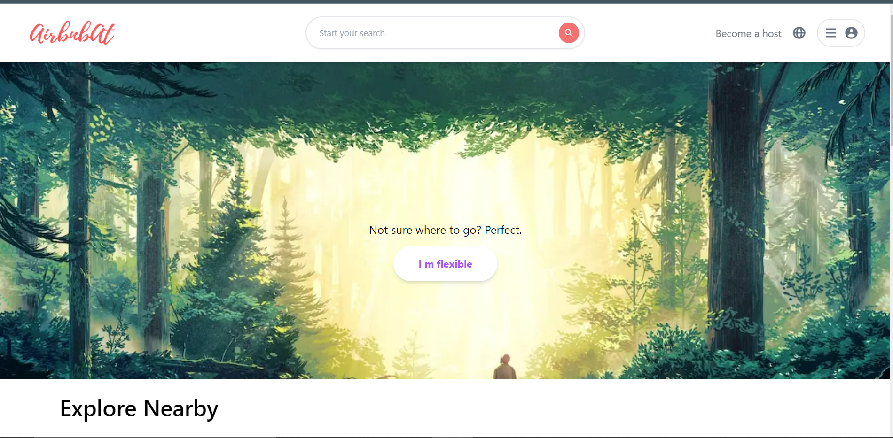
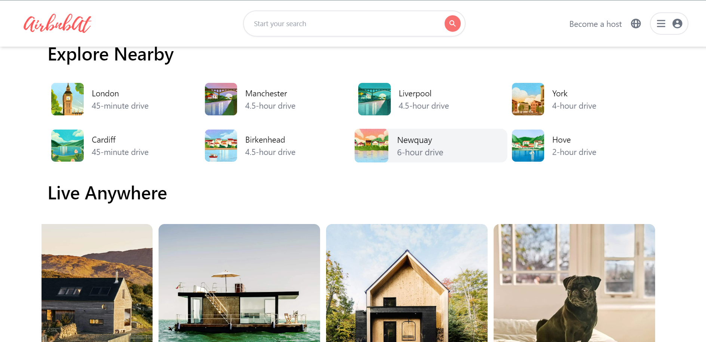
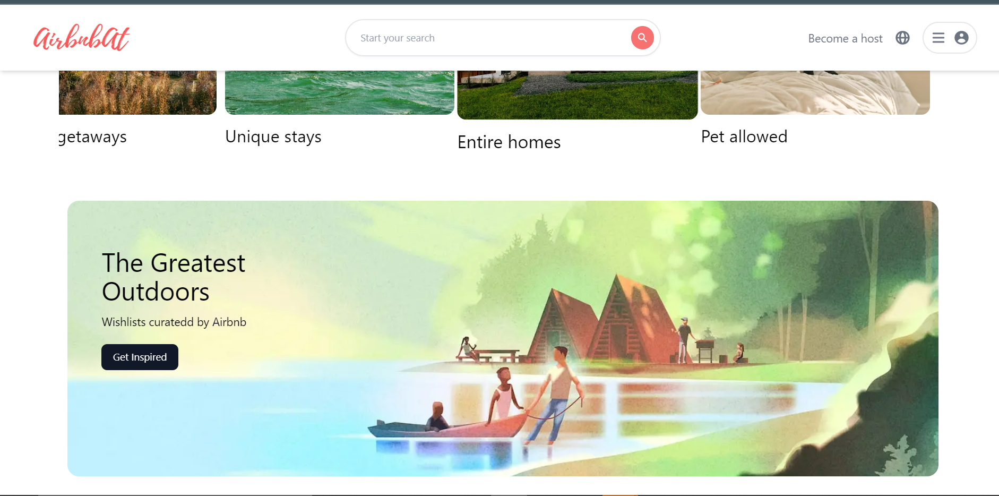
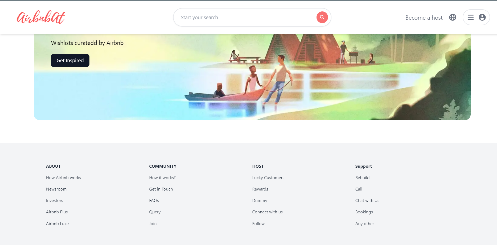
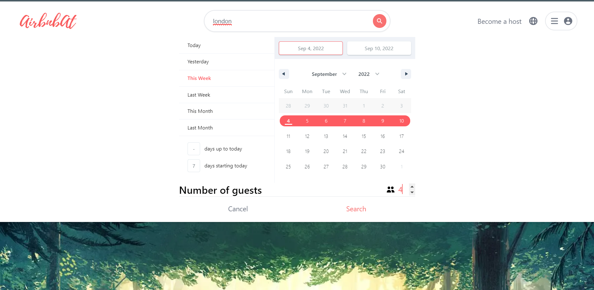
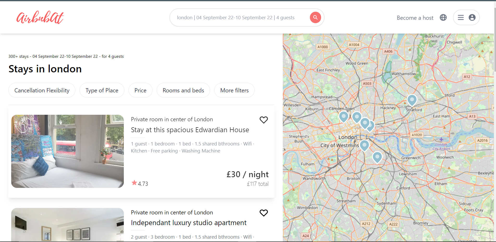
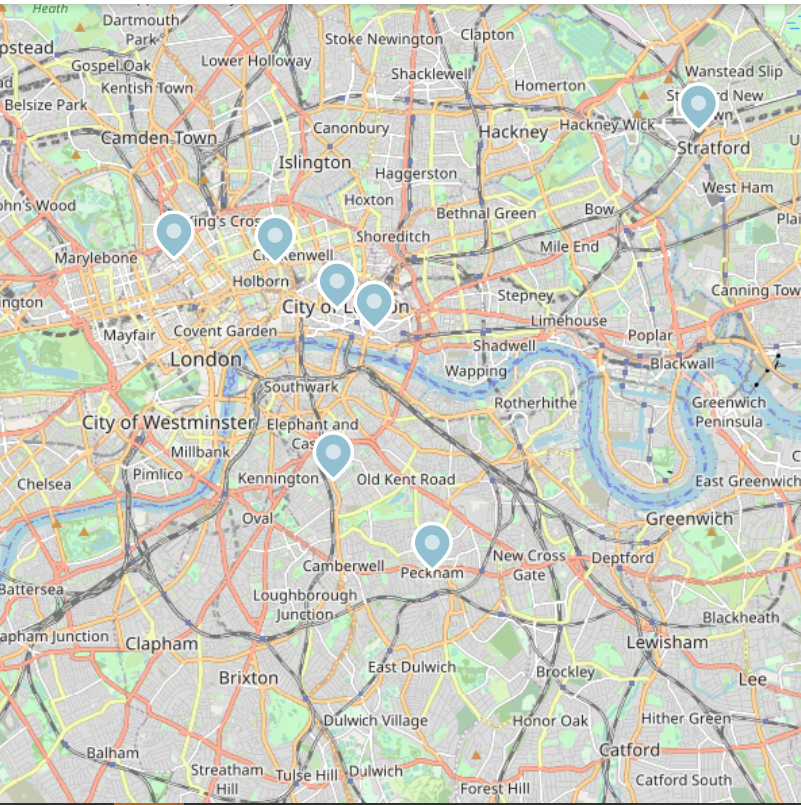

# **AirbnbAt**
## Description
[AirbnbAt](www.google.com) is an Airbnb clone built using Javascript framework **Next.js** and styled using **Tailwind CSS**. 

## Skills Stack
- [x] React.js
- [x] Next.js
- [x] Tailwind
- [x] Pigeon maps
- [x] Calendar Picker

## Features
* Pigeon Maps Integration
* Progress bar
* Fully Responsive

## Home Screen

## Calendar

## Search page

## Map

